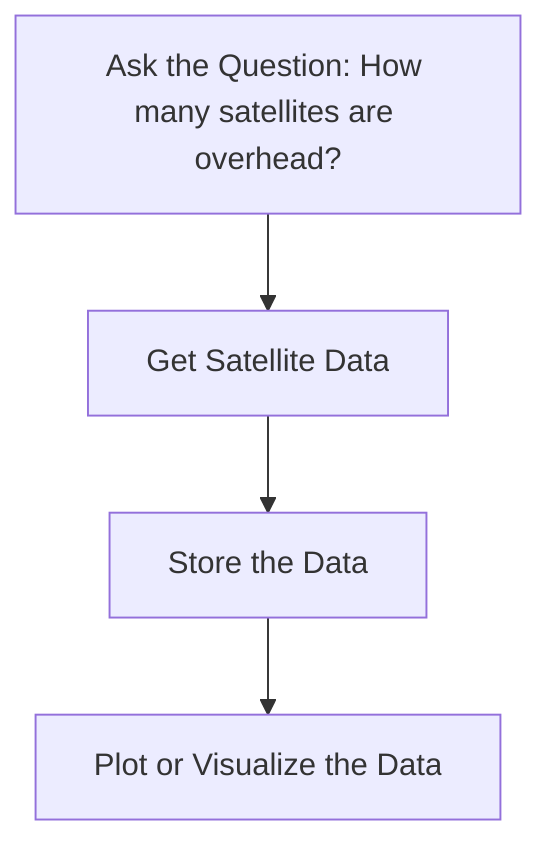

# AI-enabled Satellite Tracker Project

Walk outside and look up at the night sky. How many of those dots are satellites? How many satellites are overhead that we can't see? How might we find out?

**Ways to investigate:**

- Count the dots that move across the sky
    - LEO and MEO satellites move faster than stars, this might work.
    - GEO satellites are so far away and move at the same speed as Earth's rotation so we can't see them... Next.
- Use a telescope or binoculars to see which dots look different
    - That's a lot of dots...
- Wait, we're AI experts, let's just ask an AI like Google Gemini or Copilot: "How can I tell which dots in the sky are satellites?"

**Try this:**

1. Open your web browser and go to [Google Gemini](https://gemini.google.com/).
2. Type or say: `How many satellites are overhead of me right now?`
3. Read the answer and think about what you learn!

---

<strong>Sample Gemini Response (click to reveal)</strong>

> "That's a great question, but I can't give you a precise number without knowing your exact location and the specific definition of 'overhead.'
>
> The actual number of cataloged space objects—satellites, rocket bodies, and debris—crossing the visible sky at any given moment is always changing, but it's typically dozens of objects.
>
> According to real-time satellite trackers:
>
> &nbsp;&nbsp;&nbsp;&nbsp;At any given time, there can be dozens of objects (sometimes 80 or more) crossing the sky above a general location.
>
> &nbsp;&nbsp;&nbsp;&nbsp;This includes operational satellites like those in the GPS, Starlink, or Iridium constellations, as well as defunct satellites and debris.
>
> If you are interested in seeing a specific, visible satellite, like the International Space Station (ISS) or a Starlink train, you would need to use a real-time satellite tracking website or app. These tools use your location to calculate the exact timing, path, and brightness for objects that will be visible to you."

---

4. Do you think we can do better? How can AI help us build a better answer?

---

# AI-enabled Satellite Tracker Project

**Goal:** Answer the question: _"How many satellites are overhead right now?"_ using code, visuals, and interactive tools.

**Tools:**
   - GitHub Copilot (AI coding assistant)
   - Visual Studio Code (VS Code)
   - Python
   - Docker
   - MagicPatterns (AI Visualization Mockup)
   - JavaScript & CesiumJS (for 3D visualization)

## Project Flow (Visual Outline)

1. **Ask the Big Question**
   - _"How many satellites are overhead right now?"_

2. **Get Satellite Data... Somehow...**
    - Celestrak is a trusted website that collects and shares up-to-date information about satellites orbiting Earth. It’s used by scientists, engineers, and space agencies around the world as a reliable “source of truth” for satellite data.
   - Go to [Celestrak](https://celestrak.org/) and have a look around. It's an inmpressive site but not that helpful in it's raw form.
   - Use Python to download satellite data from [Celestrak](https://celestrak.org/)
   - Visual: Show a list or map of satellites

3. **Propagate Satellite Orbits**
   - Use Python to calculate where satellites are at a specific time
   - Visual: Animation or diagram of orbits

4. **Visualize with CesiumJS**
   - Build a web app to show satellites in 3D over the Earth
   - Visual: Interactive globe (CesiumJS)

5. **Pick a Location**
   - Click on the globe to select a spot on Earth
   - Visual: Highlight the selected point

6. **Count Overhead Satellites**
   - Show how many satellites are above the selected spot
   - Visual: Number, icons, or animation

7. **Explore and Interact**
   - Change time, location, or satellite types
   - Visual: Sliders, buttons, and real-time updates

---

## Learning Prompts & Activities

- **AI Prompts:**
  - "Ask Copilot: How do I read a file in Python?"
  - "Ask Copilot: How do I draw a point on a CesiumJS globe?"
- **Mini Challenges:**
  - Download and print the first 5 satellites from Celestrak
  - Animate a satellite moving in orbit
  - Make a button that changes the time

---

## Getting Started

1. **Open this project in VS Code**
2. **Follow the visual steps above**
3. **Use Copilot to ask questions and get code examples**
4. **Try the mini challenges and prompts**

---

## Next Steps

- Sample code and AI prompts will be added in each folder as you progress.
- Visuals and diagrams will be included to guide each step.
- No prior coding experience needed—just curiosity!

---

**Let’s build something amazing—one visual step at a time!**
