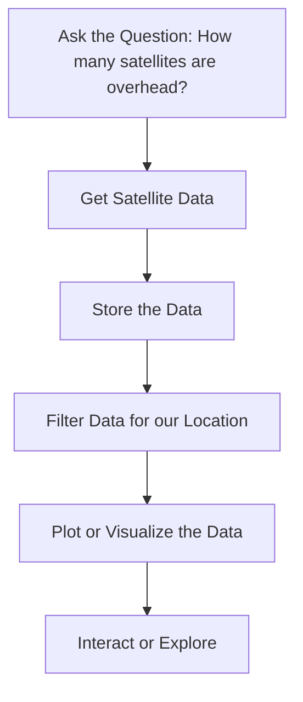

Walk outside and look up at the night sky. How many of those dots are satellites? How many satellites are overhead that we can't see? How might we find out?

**Ways to investigate:**

- Count the dots that move across the sky
    - LEO and MEO satellites move faster than stars, this might work.
    - GEO satellites are so far away and move at the same speed as Earth's rotation so we can't see them... Next.
- Use a telescope or binoculars to see which dots look different
    - That's a lot of dots...
- Wait, we're AI experts, let's just ask an AI like Google Gemini or Copilot: "How can I tell which dots in the sky are satellites?"

**Try this:**

1. Open your web browser and go to <a href="https://gemini.google.com/" target="_blank">Google Gemini</a>.
2. Type or say: `How many satellites are overhead of me right now?`
3. Read the answer and think about what you learn!

    

    
<strong>Sample Gemini Response (click to reveal)</strong>

    > "That's a great question, but I can't give you a precise number without knowing your exact location and the specific definition of 'overhead.'
    >
    > The actual number of cataloged space objects—satellites, rocket bodies, and debris—crossing the visible sky at any given moment is always changing, but it's typically dozens of objects.
    >
    > According to real-time satellite trackers:
    >
    > &nbsp;&nbsp;&nbsp;&nbsp;At any given time, there can be dozens of objects (sometimes 80 or more) crossing the sky above a general location.
    >
    > &nbsp;&nbsp;&nbsp;&nbsp;This includes operational satellites like those in the GPS, Starlink, or Iridium constellations, as well as defunct satellites and debris.
    >
    > If you are interested in seeing a specific, visible satellite, like the International Space Station (ISS) or a Starlink train, you would need to use a real-time satellite tracking website or app. These tools use your location to calculate the exact timing, path, and brightness for objects that will be visible to you."

    

4. Do you think we can do better? How can AI help us build a better answer?

---

# AI-enabled Satellite Tracker Project

**Goal:** Answer the question: _"How many satellites are overhead right now?"_ using code, visuals, and interactive tools.

**Tools:**
   - GitHub Copilot (AI coding assistant)
   - Visual Studio Code (VS Code)
   - Python
   - Docker
   - MagicPatterns (AI Visualization Mockup)
   - JavaScript & CesiumJS (for 3D visualization)

## Project Flow (Visual Outline)

---

## Next Steps

- Sample code and AI prompts will be added in each folder as you progress.
- Visuals and diagrams will be included to guide each step.
- No prior coding experience needed—just curiosity!

**Let’s build something amazing—one visual step at a time!**

## Get Set Up: Tools You’ll Need

Before you start coding, make sure you have everything you need!

### 1. Create a GitHub Account
1. Go to [https://github.com/](https://github.com/)
2. Click **Sign up** and follow the instructions to create your free account.
3. Verify your email address.

### 2. Install Visual Studio Code (VS Code)
1. Go to [https://code.visualstudio.com/](https://code.visualstudio.com/)
2. Download and install VS Code for your computer (Windows, Mac, or Linux).
3. Open VS Code after installation.

### 3. Enable GitHub Copilot
1. In VS Code, click the Extensions icon (or press `Ctrl+Shift+X`).
2. Search for **GitHub Copilot**.
3. Click **Install** next to the GitHub Copilot extension.
4. Sign in with your GitHub account if prompted.
5. You’re ready to use AI to help you code!

### 4. Install Python
1. You need to have Python installed on your computer to run Python files.
2. If you don’t have Python yet, download it from [python.org](https://www.python.org/downloads/) and install it.
3. After installing, restart VS Code.
4. When you open a `.py` file in VS Code, you may see a prompt to install the Python extension—click **Install** if prompted.
5. You can check if Python is installed by opening a terminal in VS Code and typing `python --version` (or `python3 --version` on Mac/Linux).
6. If you have any issues, see the [VS Code Python setup guide](https://code.visualstudio.com/docs/python/python-tutorial).

---

## Make Sure Everything Works: Hello World Test

Before you start with satellites, let’s make sure your setup is working!

1. Open this project folder in VS Code.
2. Create a new file called `hello.py`.
3. In the new file, type `# Write a Python program that prints Hello, world!` and press `Enter`.
4. If you have GitHub Copilot enabled, you should see a suggestion for a print statement. Press `Tab` to accept it.
5. Save the file and run it (right-click and select **Run Python File in Terminal**, or type `python hello.py` in the terminal).
6. You should see `Hello, world!` printed in the terminal.

If this works, you’re ready to start coding with Copilot!

Let's Go!
Ready to start coding? Begin with:

**[👉 Step 1: Get Satellite Data](step1_get_satellites/README.md)**

